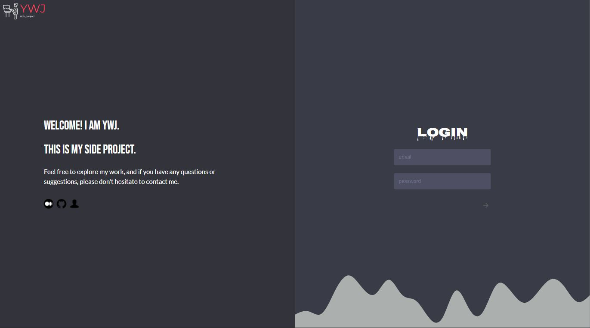
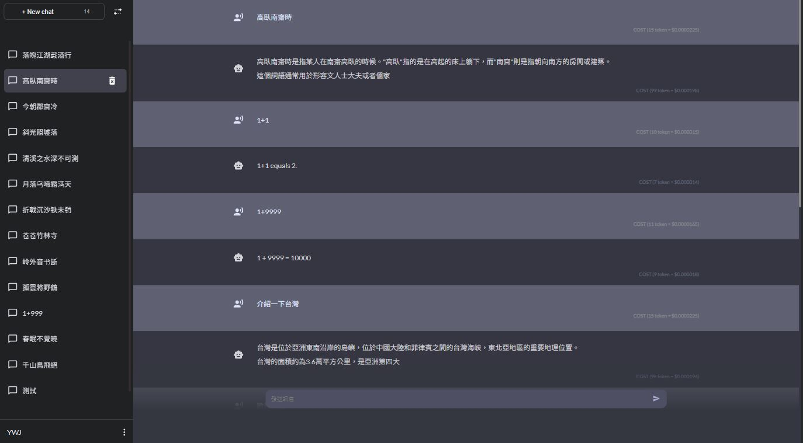
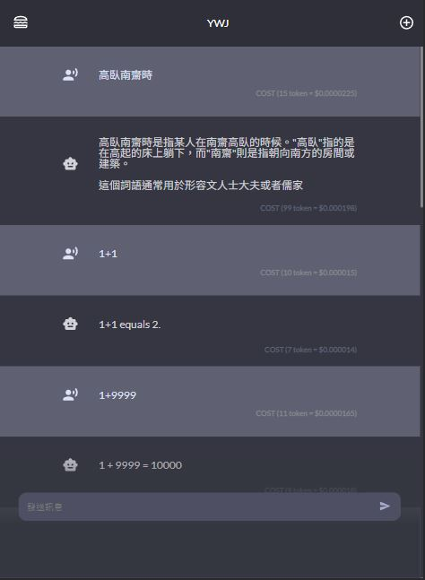

## ✨ ChatPT Clone [DEMO](https://illustrious-dasik-a7c21d.netlify.app/)

## 👋 Welcome

This is a "Simplified ChatPT" project based on the React framework. The project includes both the backend repository ([repo](https://github.com/ywcheng1207/gpt-backend-project)) and the frontend. 

The frontend mainly uses tools such as styled-components, MUI, Redux, RTK query, and GSAP.

## ✨ Features
Users can log in with a test account, ask questions, delete chat records, and perform other ChatGPT functionalities.

Since OPENAI's API is not free, if you'd like to try logging into my project, please feel free to contact me anytime. However, you can still clone my frontend and backend repositories and register your own OpenAI account to try this project.

## ✨ Tools version
    "redux": "^4.2.1",
    "@reduxjs/toolkit": "^1.9.7",
    "styled-components": "^6.1.0",
    "@mui/material": "^5.14.16",
    "gsap": "^3.12.2",
    "js-cookie": "^3.0.5",
    "uuid": "^9.0.1",
